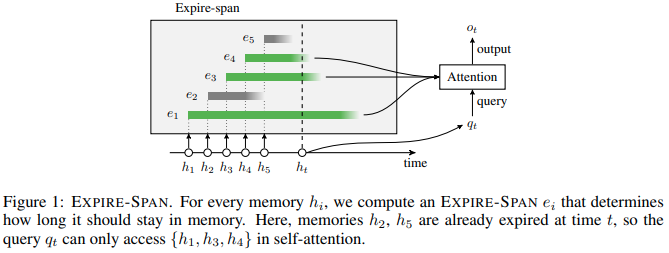

</img>

## Learning to Expire - Pytorch (wip)

An implementation of Transformer with <a href="https://openreview.net/forum?id=ZVBtN6B_6i7">Expire-Span</a>, a proposed technique for learning which memories to retain for long-range learning in attention-based networks.

## Citations

```bibtex
@inproceedings{
    anonymous2021not,
    title={Not All Memories are Created Equal: Learning to Expire},
    author={Anonymous},
    booktitle={Submitted to International Conference on Learning Representations},
    year={2021},
    url={https://openreview.net/forum?id=ZVBtN6B_6i7},
    note={under review}
}
```
